# My collection of Processing sketches

## Shooter2D
A simple 2D game, where your goal is to shoot at a moving target. If anything else is hit, you'll loose some health, until you die.

There are multiple difficulties to choose from: easy, medium and hard.
The number of obstacles increases with the difficulty.

## Basketball
A simple basketball scene, where you can launch the ball by dragging the mouse. If you hit the net (the green rectangle) the ball you'll score a point and the ball will reset.

The collision between the ball and the corners of the rectangles is unfortunatly really buggy.

## EloGame
A simple sketch I made to use Perlin noise for procedural terrain generation.

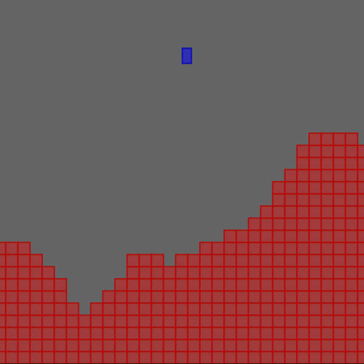

## FlappySquare
A simple flappy bird clone, but with a square instead of a bird in order to make collisions easier.

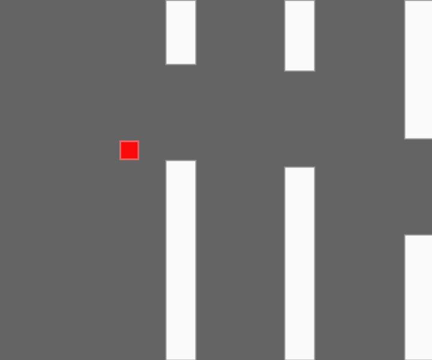

## BattagliaNavale
A battleship clone, done for a school project, where you could play online using a school server.
Unfortunatly the server is no longer working, so you cannot go past the initial menu.

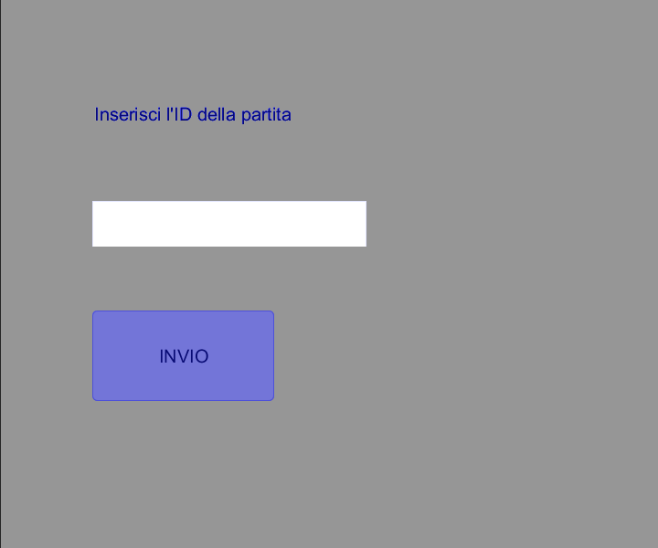

## DistribuzioneVoti
A simple program made to visualize the distribution of a list of grades in a graph. The grades are grouped together if inside a certain interval, that can be changed.

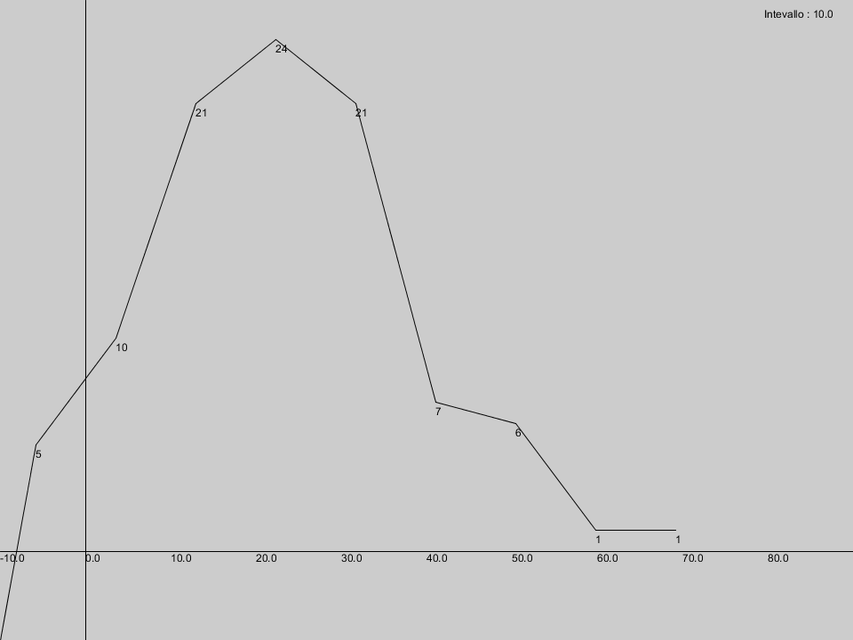

## LancettaMobile
A simple program to test the translation of the origin in Processing.
If the mouse wheel is pressed, the stars will be launched in the opposite way of the mouse movement.

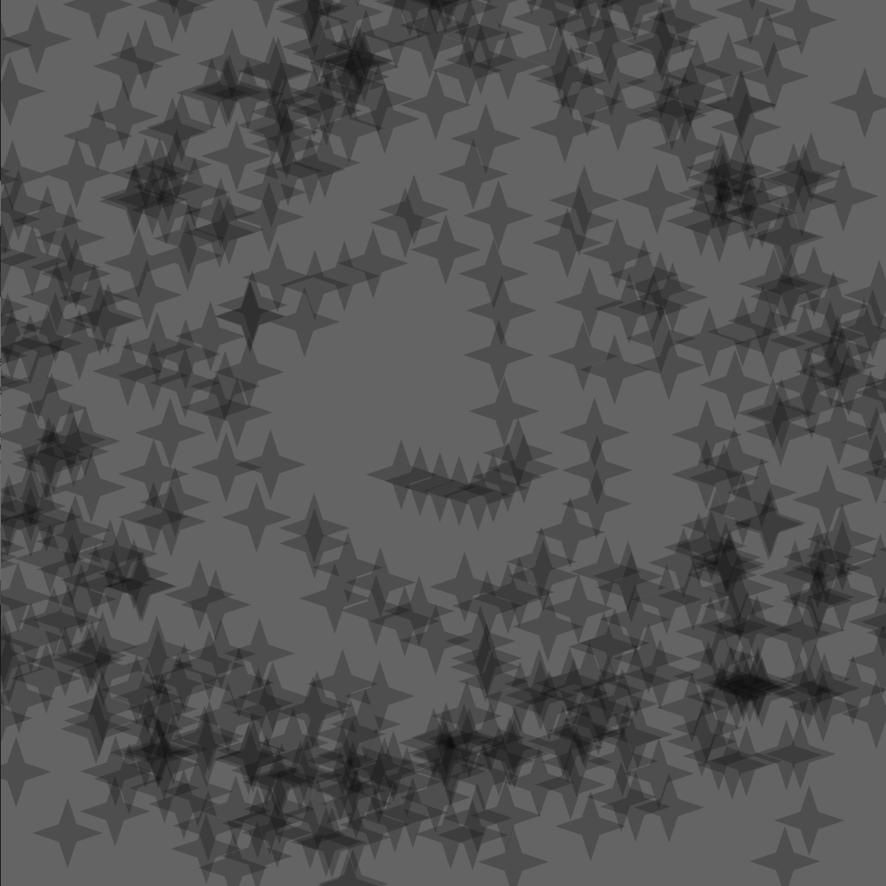

## Orologio
A simple clock that counts only the seconds.

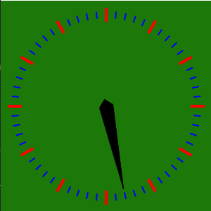

## RappresentazioneGeoAnalitica
A simple program to plot a parabola, and potentially also other type of functions.

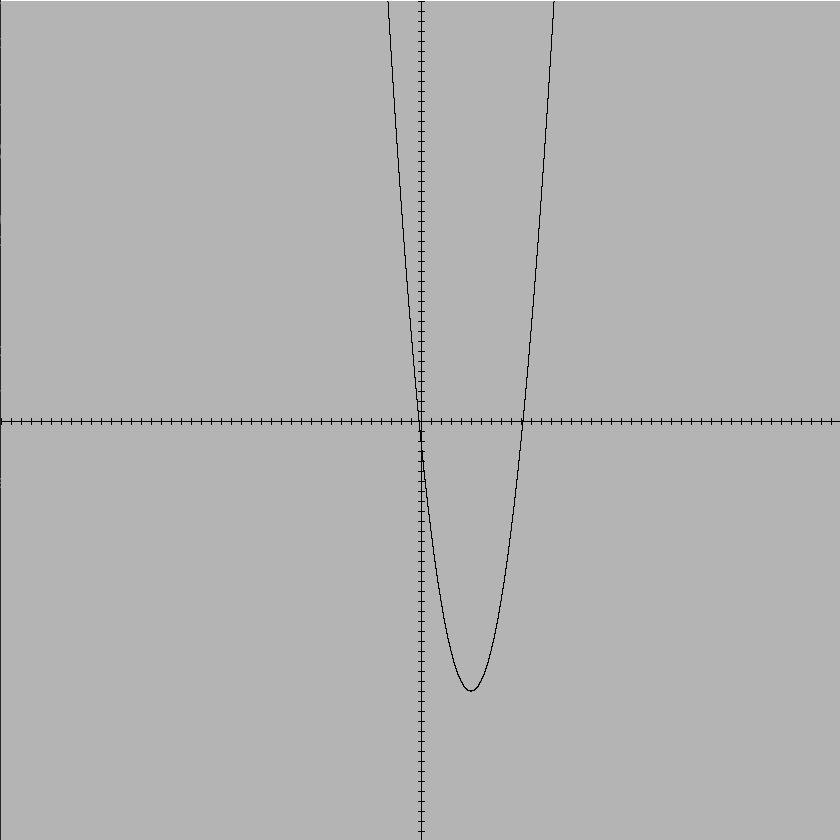

## RampaESalta
There are two stages:
- in the first you can move your mouse around to choose the direction of the ramp and the position of the ball
- when you press a mouse button, the ramp will be set and the ball will spawn, falling down base on the ramp direction.

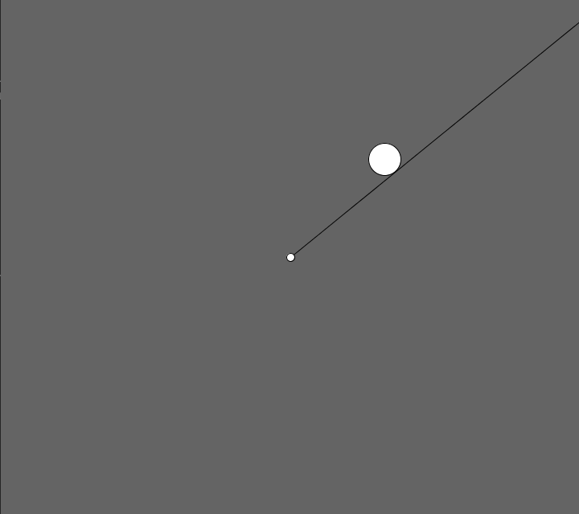

## SnakeGame
A snake clone, with some random rainbow effect.

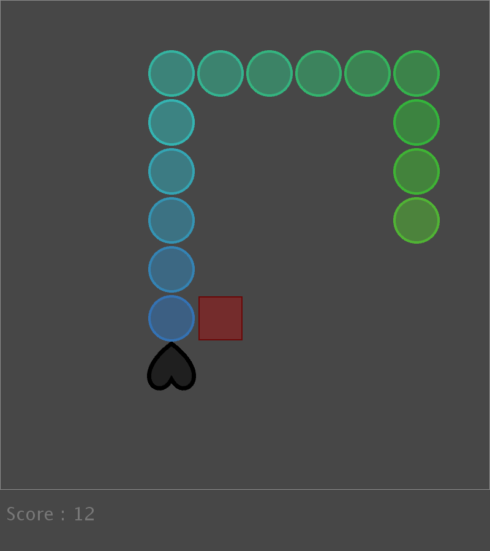

## Tetris
A very buggy tetris clone. When you complete a line, it bugs out.

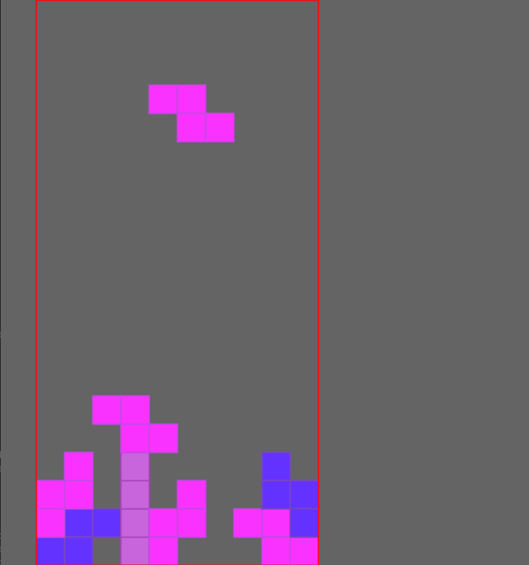

## TabellonePunti
A program made as a school project to make scorekeeping more accessible.
The application is connected throught an USB connection to an Arduino device, on which a special controller was built.

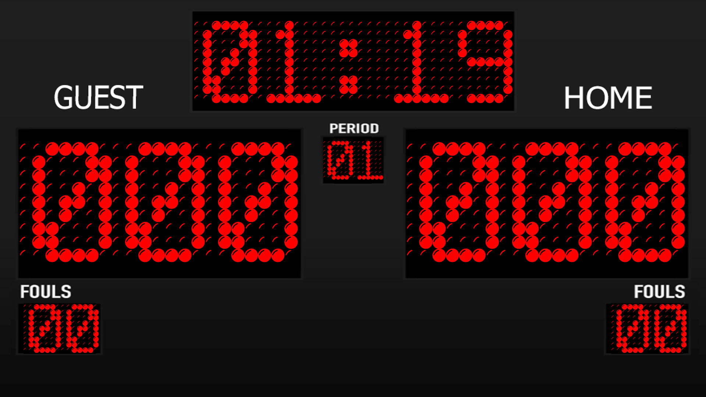
