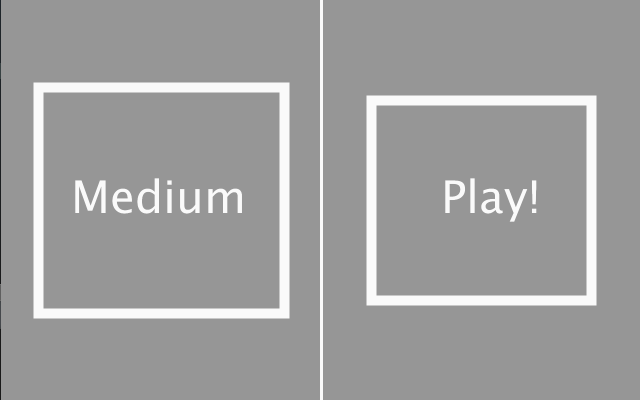
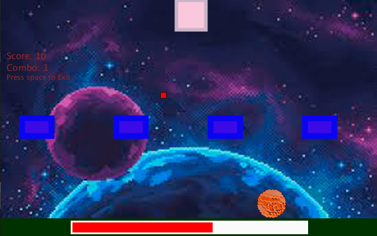
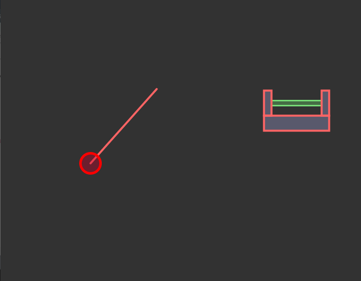

# My collection of Processing sketches

## Shooter2D
A simple 2D game, where your goal is to shoot at a moving target. If anything else is hit, you'll loose some health, until you die.

There are multiple difficulties to choose from: easy, medium and hard.
The number of obstacles increases with the difficulty.

## Basketball
A simple basketball scene, where you can launch the ball by dragging the mouse. If you hit the net (the green rectangle) the ball you'll score a point and the ball will reset.

The collision between the ball and the corners of the rectangles is unfortunatly really buggy.

